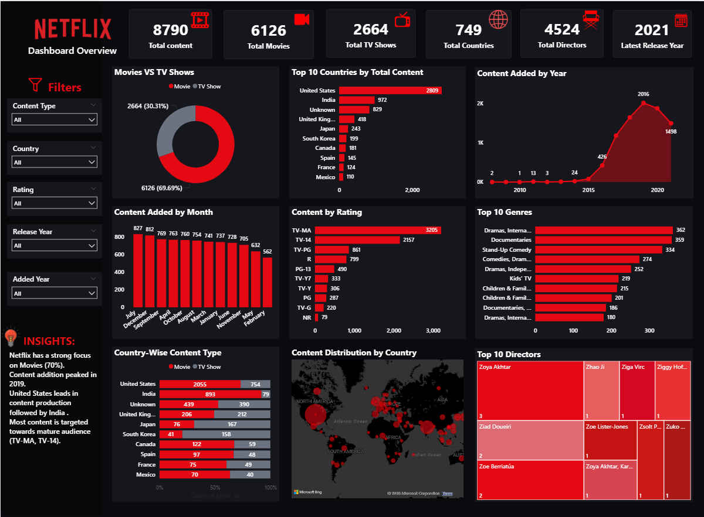

# 🎬 Netflix Content Analysis

An end-to-end Data Analytics project analyzing Netflix's content catalog using Python, PostgreSQL, and Power BI to uncover content distribution patterns, country-wise production trends, audience ratings, genre patterns, and content growth over time.

---

## 📊 Project Overview

The objective of this project is to analyze Netflix's content library and answer important business questions related to:

* Content type distribution
* Country-wise content production
* Content rating preferences
* Yearly content growth
* Genre distribution
* Director contribution
* Movie vs TV Show trends across countries

The project follows a complete data analytics workflow:

**Data Cleaning → Exploratory Data Analysis → SQL Business Analysis → Power BI Dashboard → Business Insights**

---

## 🎯 Business Objective

Netflix has a large and diverse content catalog. This project analyzes the catalog to identify:

1. Which type of content dominates Netflix — Movies or TV Shows?
2. Which countries contribute the most content?
3. Which audience ratings are most common?
4. How has Netflix's content library grown over time?
5. Which genres are most represented?
6. Which countries focus more on Movies versus TV Shows?

---

## 🛠️ Tools & Technologies

| Tool       | Purpose                                    |
| ---------- | ------------------------------------------ |
| Python     | Data Cleaning & Exploratory Data Analysis  |
| Pandas     | Data Manipulation                          |
| NumPy      | Numerical Analysis                         |
| PostgreSQL | Business Analysis & SQL Queries            |
| Power BI   | Interactive Dashboard & Data Visualization |
| DAX        | KPI Measures & Calculations                |
| GitHub     | Version Control & Project Documentation    |

---

## 📁 Project Structure

```text
Netflix-Content-Analysis/
│
├── data/
│   └── netflix data.csv
│
├── python/
│   └── Netflix project.ipynb
│
├── sql/
│   └── NETFLIX PROJECT.sql
│
├── powerbi/
│   └── Netflix_Dashboard.pbix
│
├── screenshots/
│   └── Netflix_Dashboard.png
│
├── report/
│   └── Netflix_Content_Analysis_Report.pdf
│
└── README.md
```

---

## 🧹 Data Cleaning & Preparation

The dataset was analyzed and prepared using Python.

### Data Quality Checks

* Dataset structure and data types were inspected
* Duplicate records were checked
* Missing values were analyzed
* Date fields were converted into proper datetime format
* New time-based features were created

### Missing Value Treatment

Missing values in categorical fields such as:

* `director`
* `cast`
* `country`

were handled using `"Unknown"` to preserve valuable records.

Rows with missing critical information such as:

* `date_added`
* `rating`
* `duration`

were removed where appropriate.

### Feature Engineering

The following features were created:

* `added_year`
* `added_month`
* `added_day`

These features were used for time-based business analysis.

---

## 🔍 Exploratory Data Analysis

The following areas were analyzed using Python:

* Movies vs TV Shows distribution
* Top content-producing countries
* Content rating distribution
* Yearly content additions
* Genre distribution
* Director contribution
* Country-wise Movie and TV Show comparison

---

## 🗄️ PostgreSQL Business Analysis

Business questions were answered using PostgreSQL.

### Key SQL Analysis Areas

* Distribution of Movies and TV Shows
* Top content-producing countries
* Most common content ratings
* Year with the highest content additions
* Top directors by number of titles
* Country-wise Movie production
* Country-wise TV Show production
* Movie vs TV Show percentage distribution
* Year-over-year content growth
* Rating analysis by content type
* Country ranking using window functions

### SQL Concepts Used

* `GROUP BY`
* `ORDER BY`
* `WHERE`
* `HAVING`
* `CASE WHEN`
* Aggregate Functions
* Window Functions
* `LAG()`
* `DENSE_RANK()`

---

## 📊 Power BI Dashboard

An interactive Power BI dashboard was created to provide a high-level overview of Netflix's content library.

### Dashboard Components

#### KPI Cards

* Total Content
* Total Movies
* Total TV Shows
* Total Countries
* Total Directors
* Latest Release Year

#### Visualizations

* Movies vs TV Shows Distribution
* Top 10 Countries by Content
* Content Added by Year
* Content Added by Month
* Rating Distribution
* Top Genres
* Country vs Content Type
* Geographic Content Distribution
* Top Directors

#### Interactive Filters

* Content Type
* Country
* Rating
* Release Year

---

## 🖼️ Dashboard Preview



---

## 📈 Key Business Insights

### 1. Movies Dominate the Netflix Catalog

Movies represent approximately **69.7%** of the analyzed content, while TV Shows account for approximately **30.3%**.

This indicates a historically movie-heavy content catalog.

---

### 2. United States Leads Content Production

The United States is the largest content contributor with approximately **2,809 titles**.

India ranks second with approximately **972 titles**.

---

### 3. TV-MA Is the Most Common Rating

TV-MA is the most frequently occurring rating in the dataset.

This indicates a strong presence of mature-audience content within Netflix's catalog.

---

### 4. 2019 Recorded the Highest Content Additions

The highest number of titles were added in **2019**, with approximately **2,016 titles**.

This reflects a period of aggressive content expansion.

---

### 5. Netflix Experienced Strong Content Expansion

Content additions increased significantly between **2016 and 2020**, demonstrating rapid catalog expansion during this period.

---

### 6. India Has a Movie-Dominant Content Portfolio

India contributes significantly more Movies than TV Shows, indicating a strong movie-oriented content mix.

---

### 7. The United Kingdom Shows a More Balanced Content Mix

The United Kingdom has a comparatively more balanced distribution between Movies and TV Shows.

---

### 8. Drama and Documentary Content Are Highly Represented

Drama-related international content and documentaries are among the most frequently occurring content categories.

---

## 💡 Business Recommendations

### 1. Continue Investing in International Content

Netflix should continue expanding its international content strategy, particularly in high-contribution markets such as India and other emerging regions.

### 2. Strengthen Regional Content Strategies

Content acquisition strategies should be adapted to regional audience preferences.

### 3. Expand TV Show Production in Movie-Dominant Markets

Markets with a strong movie-heavy portfolio may represent opportunities for increased TV Show production.

### 4. Maintain a Balanced Content Portfolio

Netflix should maintain a balance between mature-audience content, family content, documentaries, dramas, and international productions.

### 5. Use Data-Driven Content Acquisition

Content investment decisions can be improved by combining country, genre, rating, and historical growth trends.

---

## 🧠 Key Skills Demonstrated

* Data Cleaning
* Exploratory Data Analysis
* Missing Value Treatment
* Feature Engineering
* Business Problem Solving
* SQL Business Analysis
* PostgreSQL
* Window Functions
* Power BI Dashboard Development
* DAX Measures
* Data Visualization
* Business Insight Generation
* Data Storytelling

---

## 🚀 End-to-End Workflow

```text
Raw Netflix Dataset
        ↓
Python Data Cleaning
        ↓
Feature Engineering
        ↓
Exploratory Data Analysis
        ↓
PostgreSQL Business Analysis
        ↓
Power BI Dashboard
        ↓
Business Insights
        ↓
Business Recommendations
```

---

## 🏁 Conclusion

This project demonstrates an end-to-end data analytics workflow using Python, PostgreSQL, and Power BI.

The analysis transformed raw Netflix catalog data into meaningful business insights related to content distribution, country-wise production, ratings, genres, and content growth.

The project showcases the ability to:

**Analyze Data → Answer Business Questions → Build Interactive Dashboards → Generate Actionable Insights**

---

## 👤 Author

**Ujjal Mondal**

Aspiring Data Analyst

Skills: Python | SQL | PostgreSQL | Power BI | Excel | Data Analytics


